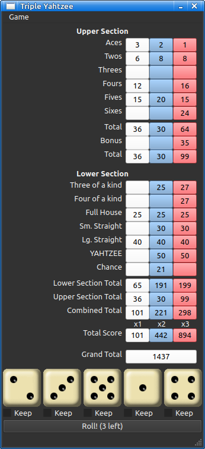

# tripleytz
An implementation of the classic game "Triple Yahtzee".



## Building From Source
`tripleytz` requires the `CMake` build system, the `Qt6` platform, and a C++17 compatible compiler. The project my be built either by loading the CMakeLists.txt file into QtCreator and building from there, or from the command line shell using CMake directly.

### Linux and macOS
To build on Linux or macOS at the command line shell, start in the main project directory, create a `build` subdirectory, run `cmake` then run `make`:
```console
$ mkdir build
$ cd build
build$ cmake -DCMAKE_PREFIX_PATH:PATH=<path-to-qt-config> ..
build$ make
```
Substitute `<path-to-qt-config>` with the path to your Qt CMake configurations. On my system it is `~/Qt/6.4.2/gcc_64`.

### Windows
To build on Windows, open a command prompt---cmd or PowerShell or whatever you use---starting in the main project directory, create a `build` subdirectory, then run `CMake`:
```console
> mkdir build
build> cmake -DCMAKE_PREFIX_PATH:PATH=<path-to-qt-config> ..
```
Substitute `<path-to-qt-config>` with the path to your Qt CMake configurations. On my system it is `C:\Qt\6.4.2\msvc2019_64`.

`cmake` will create a Visual Studio solution file `tripleytz.sln`.
